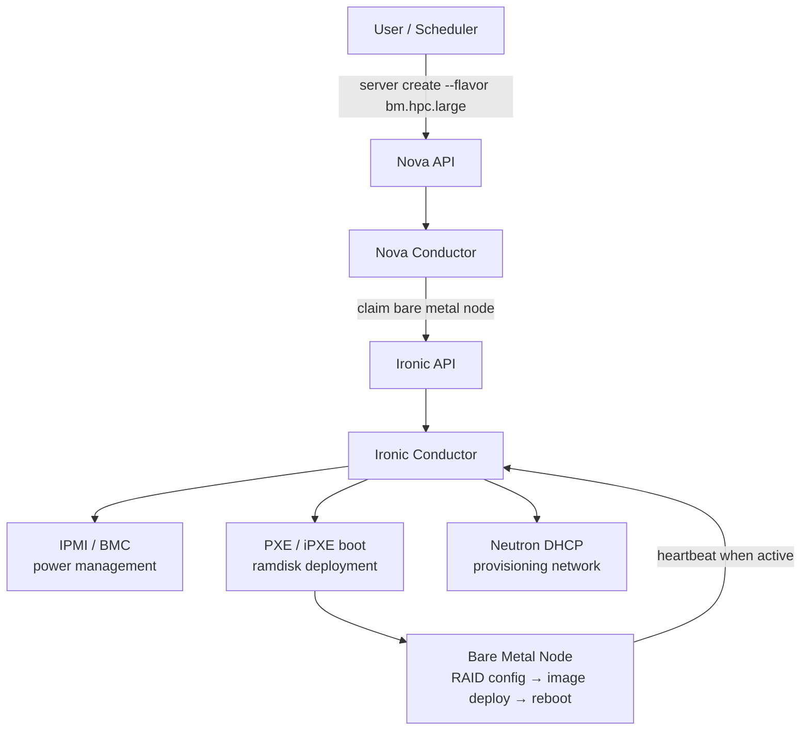
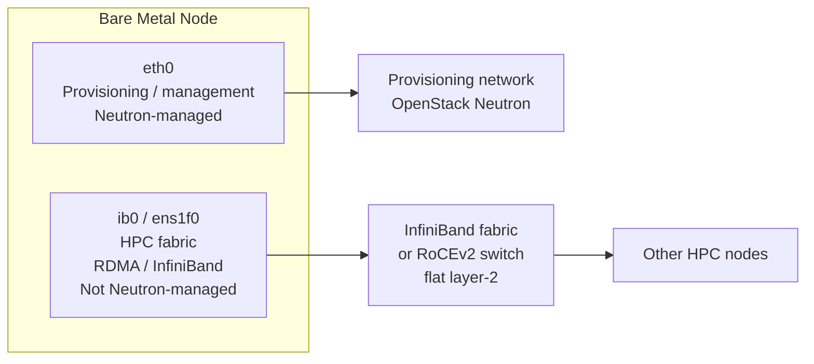
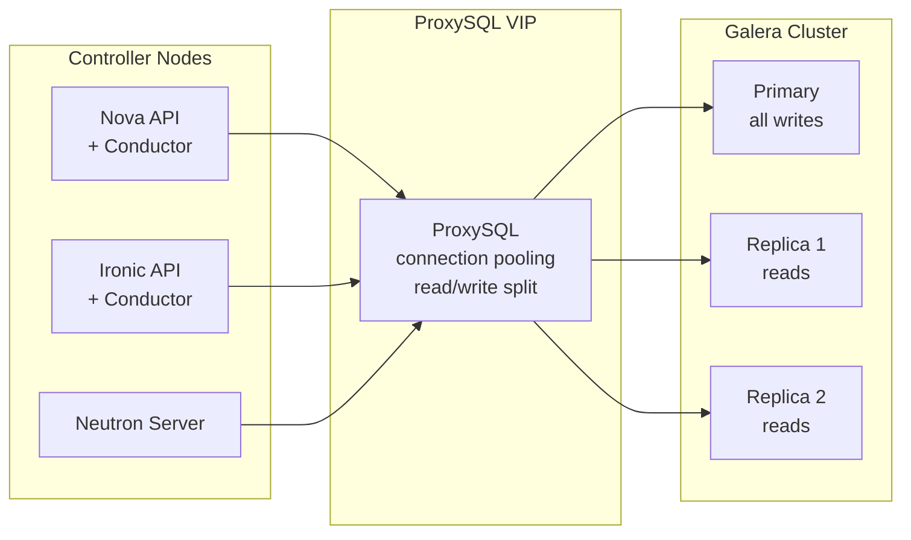

# Bare Metal OpenStack for HPC — Performance Tuning and Control Plane Decisions

If you're running HPC workloads — MPI jobs, CFD, molecular dynamics, AI training clusters — on OpenStack, you've probably already arrived at the same conclusion most HPC teams reach: virtualisation overhead is incompatible with your latency budget. KVM adds microseconds you can't afford, and the NUMA topology games required to extract decent performance from a VM are genuinely painful. The answer is bare metal provisioning via Ironic, and OpenStack is actually a very capable platform for it when it's configured properly.

The challenge is that "bare metal OpenStack" is not the same as "OpenStack with the default config and no VMs". Bare metal for HPC requires deliberate tuning at every layer — BIOS, kernel, OpenStack services, and networking — and several of those tuning decisions interact in non-obvious ways. This post covers the decisions that consistently matter most in practice.

There's also a database conversation that comes up on every large HPC deployment eventually. The OpenStack control plane runs on MariaDB with Galera replication, and at a certain scale that database needs to live somewhere other than the controller nodes. We'll get to that too.

---

## Why Bare Metal for HPC?

The short version: latency and determinism. HPC workloads that span multiple nodes are dominated by interconnect performance, and that interconnect needs to be as close to the hardware as possible. A well-configured VM can get you far, but you're always fighting the hypervisor for NUMA locality, CPU scheduling, and memory bandwidth.

Bare metal gives you:

- **Direct hardware access** — no vCPU, no NUMA boundary crossing, no memory balloon driver
- **InfiniBand and RoCEv2 passthrough** — RDMA without SR-IOV workarounds
- **Predictable CPU topology** — you get exactly what the hardware says, not what the scheduler decided to give you
- **OS-bypass networking** — DPDK, RDMA, and GPUDirect all work as designed

The trade-off is provisioning speed and hardware utilisation. Bare metal nodes take minutes to provision rather than seconds, and you don't get memory oversubscription. For HPC, that's usually the right trade-off.

---

## How Ironic Fits Into OpenStack

Ironic is the OpenStack bare metal provisioning service. It sits alongside Nova, takes over the node scheduling role for physical hardware, and handles the full lifecycle from PXE boot through to in-use and decommission. From a user perspective it looks like any other Nova flavour — you `openstack server create` and get a bare metal node back.





The Ironic conductor manages the state machine for each node — enrolling it, running introspection, moving it through `available` → `deploying` → `active` → `cleaning` → back to `available`. The deploy step writes your OS image directly to disk via a temporary ramdisk running in RAM.

For HPC at scale, you'll typically segment node types as Nova host aggregates:

| Aggregate | Node type | Typical flavour |
|---|---|---|
| `hpc-compute` | Compute nodes — high core count, large DRAM | `bm.hpc.compute` |
| `hpc-gpu` | GPU nodes — A100/H100, NVLink | `bm.hpc.gpu` |
| `hpc-highmem` | Large memory nodes — in-memory analytics | `bm.hpc.highmem` |
| `hpc-storage` | NVMe-heavy storage nodes | `bm.hpc.storage` |

---

## BIOS and Firmware — Sort This First

Every performance tuning conversation for HPC starts here, because nothing you do at the OS or OpenStack layer compensates for a BIOS that's optimised for power saving. These settings are the ones that consistently make the biggest difference.

### CPU Power Management

Disable every power-saving feature the BIOS exposes. All of them.

| Setting | Value | Why |
|---|---|---|
| CPU Power Management | `OS Control` or `Disabled` | Hand control to the OS, don't let the BMC throttle cores |
| Intel Turbo Boost / AMD Precision Boost | Disabled | Turbo is non-deterministic — one core boosts, others throttle |
| C-States | `C0/C1` only — disable C3, C6, C7 | Deep C-states add wake latency measured in microseconds |
| P-States | Disabled — set performance governor in OS | Let the OS hold cores at max frequency |
| Energy Efficient Turbo | Disabled | Incompatible with sustained HPC loads |
| Power Capping | Off | Don't cap nodes below TDP during a job run |

### NUMA and Memory

| Setting | Value | Why |
|---|---|---|
| NUMA Topology | Enabled | Essential — OS must see the correct NUMA layout |
| Memory Interleaving | Per-NUMA / disabled | Interleaving improves average bandwidth but kills worst-case latency |
| Sub-NUMA Clustering (SNC) | Enabled (verify with workload) | Can halve effective memory latency on AMD EPYC and Intel SPR |
| Transparent Huge Pages | Disabled | Set `madvise` in OS instead — THP causes latency spikes during defrag |
| Memory Speed | Maximum XMP/EXPO profile | Default JEDEC speeds leave significant bandwidth on the table |

### Hyperthreading

For MPI-heavy workloads: disable it. SMT threads share execution units and L1/L2 cache, which hurts memory-bound HPC. For mixed or embarrassingly parallel GPU workloads, benchmark first — the answer isn't always obvious.

---

## OS-Level Tuning

Once the BIOS is right, the OS needs to match. This is applied to your Ironic deploy image — bake it in rather than applying it post-boot.

### CPU Governor and IRQ Affinity

```bash
# Set performance governor on all cores
for cpu in /sys/devices/system/cpu/cpu*/cpufreq/scaling_governor; do
  echo performance > $cpu
done

# Pin IRQs to non-compute cores (assuming cores 0-1 are reserved for OS)
cat /proc/interrupts | awk '{print $1}' | grep ':' | sed 's/://' | \
  xargs -I{} sh -c 'echo 3 > /proc/irq/{}/smp_affinity'
```

### Huge Pages

```bash
# Static 1G huge pages — set at boot, not runtime
# Add to kernel cmdline in your Ironic deploy image
GRUB_CMDLINE_LINUX="... hugepagesz=1G hugepages=64 default_hugepagesz=1G"

# Or 2M pages if 1G isn't suitable for your workload
GRUB_CMDLINE_LINUX="... hugepages=4096"
```

### Kernel Parameters

```bash
# /etc/sysctl.d/99-hpc.conf
kernel.numa_balancing = 0          # Disable automatic NUMA balancing — it fights CPU pinning
vm.swappiness = 0                  # Don't swap under any circumstances
vm.dirty_ratio = 80
vm.dirty_background_ratio = 5
net.core.rmem_max = 134217728
net.core.wmem_max = 134217728
net.ipv4.tcp_rmem = 4096 87380 134217728
net.ipv4.tcp_wmem = 4096 65536 134217728
net.core.netdev_max_backlog = 250000
net.ipv4.tcp_congestion_control = bbr
```

### NUMA Balancing

Disable it explicitly via the kernel command line as well — `sysctl` can be overridden at runtime by misbehaving processes:

```bash
# Add to GRUB_CMDLINE_LINUX
numa_balancing=disable isolcpus=2-127 nohz_full=2-127 rcu_nocbs=2-127
```

`isolcpus` removes cores 2–127 from the general scheduler pool. Combined with NUMA-aware MPI process pinning, this eliminates OS jitter on compute cores.

---

## OpenStack Nova — Bare Metal Scheduler Tuning

Nova's scheduler needs to understand your hardware topology to make good placement decisions.

### Resource Classes

Ironic nodes should expose custom resource classes that reflect their actual hardware:

```bash
openstack baremetal node set <node-uuid> \
  --resource-class baremetal.hpc.compute

openstack flavor set bm.hpc.compute \
  --property resources:CUSTOM_BAREMETAL_HPC_COMPUTE=1 \
  --property resources:VCPU=0 \
  --property resources:MEMORY_MB=0 \
  --property resources:DISK_GB=0
```

Setting `VCPU`, `MEMORY_MB`, and `DISK_GB` to zero tells the Nova scheduler to ignore those standard dimensions and rely solely on the custom resource class. Without this, you'll get scheduling failures or over-allocation.

### Host Aggregates and AZ Mapping

```bash
# Create aggregate per node type
openstack aggregate create hpc-compute --zone hpc-az

# Add nodes to aggregate
openstack aggregate add host hpc-compute <ironic-host-1>
openstack aggregate add host hpc-compute <ironic-host-2>

# Restrict flavour to aggregate
openstack flavor set bm.hpc.compute \
  --property aggregate_instance_extra_specs:hpc-type=compute
openstack aggregate set hpc-compute \
  --property hpc-type=compute
```

### Conductor Workers

At HPC scale, the default conductor worker count is too low. The Ironic conductor is single-threaded per node during deployment; with hundreds of nodes provisioning simultaneously you need enough workers to cover the burst:

```ini
# /etc/ironic/ironic.conf
[DEFAULT]
conductor_workers = 64

[conductor]
deploy_kernel = <glance-uuid>
deploy_ramdisk = <glance-uuid>
automated_clean = true
clean_callback_timeout = 1800
```

---

## Networking — The Part That Actually Limits You

For HPC, the interconnect is usually InfiniBand or RoCEv2. OpenStack Neutron manages the provisioning and tenant network, but the HPC fabric often sits entirely outside Neutron's management plane and is configured directly by the workload scheduler (SLURM, PBS, etc.).



### MTU

Set MTU to 9000 (jumbo frames) on every interface in the HPC path — the switch ports, the bond, and the OS:

```bash
# In your deploy image's network config (e.g. NetworkManager nmconnection)
[802-3-ethernet]
mtu=9000
```

Mismatch between switch and host MTU is one of the most common causes of unexplained throughput drops. Verify end-to-end with:

```bash
ping -c 4 -M do -s 8972 <remote-node-ip>   # 8972 + 28 byte header = 9000
```

### RDMA / InfiniBand

Ironic doesn't provision InfiniBand ports — that happens at the fabric level. What Ironic can do is ensure the OFED stack is baked into your deploy image and that IPoIB or RoCE interfaces come up correctly on first boot.

For OpenStack-managed tenant networking over RoCEv2, Neutron's `sriovnicswitch` mechanism driver handles PF/VF allocation. For HPC, the simpler approach is to leave the HPC fabric flat and unmanaged by Neutron, and let SLURM or your job scheduler handle partitioning.

---

## Storage for HPC

Storage is workload-dependent, but the common patterns for HPC are:

| Pattern | When to use |
|---|---|
| Local NVMe (ephemeral) | Scratch space, checkpoint files, single-node I/O intensive jobs |
| Ceph RBD (persistent) | Shared data, result storage, image-backed root disks |
| Lustre / GPFS (external) | Parallel file system for tightly coupled multi-node jobs — not managed by OpenStack |
| NVMe-oF | Where you want NVMe performance over the network fabric — emerging, but viable for some HPC patterns |

For Ceph backing OpenStack in an HPC context:

```ini
# /etc/ceph/ceph.conf — tuning relevant to HPC workloads
[osd]
osd_journal_size = 10240
osd_recovery_max_active = 3
osd_max_backfills = 2
filestore_queue_max_ops = 500
filestore_queue_max_bytes = 104857600

[client]
rbd_cache = true
rbd_cache_size = 134217728      # 128 MB client-side cache
rbd_cache_max_dirty = 67108864
```

For scratch workloads, configure ephemeral disk on the bare metal node directly:

```ini
# nova.conf on the ironic conductor host
[DEFAULT]
default_ephemeral_format = ext4

[ironic]
use_unsafe_iscsi = false
```

---

## The OpenStack Control Plane Database

Every OpenStack service — Nova, Neutron, Ironic, Keystone, Glance, Cinder, Heat — writes state to MariaDB. In a default deployment that database lives on the controller nodes, co-located with the API services, running as a Galera cluster across the three controllers.

For small-to-medium deployments, that's fine. For large HPC deployments, it becomes the bottleneck.


```mermaid
graph TD
    subgraph default["Default: Co-located"]
        CTRL1["Controller 1\nAPI services\nMariaDB / Galera"]
        CTRL2["Controller 2\nAPI services\nMariaDB / Galera"]
        CTRL3["Controller 3\nAPI services\nMariaDB / Galera"]
    end

    subgraph split["Split: Dedicated DB Cluster"]
        APICTRL1["Controller 1\nAPI services only"]
        APICTRL2["Controller 2\nAPI services only"]
        APICTRL3["Controller 3\nAPI services only"]

        DB1["DB Node 1\nMariaDB / Galera\nPrimary"]
        DB2["DB Node 2\nMariaDB / Galera\nReplica"]
        DB3["DB Node 3\nMariaDB / Galera\nReplica"]

        APICTRL1 --> DB1
        APICTRL2 --> DB2
        APICTRL3 --> DB3
    end
```


### When to Keep It Co-located

Co-located works well when:

- Your cluster is under ~200 compute nodes
- You have a steady, predictable provisioning rate — not bursting hundreds of nodes at once
- Controller hardware is already overspecced (≥32 cores, ≥128 GB RAM per controller)
- Ironic conductor and Nova conductor are running on separate hosts from the API controllers

The Galera write path serialises through the primary node, so as long as API service load is moderate, there's no contention.

### When to Split the Database Out

Split the database to dedicated nodes when you're seeing any of these:

| Signal | What it means |
|---|---|
| `wsrep_flow_control_sent` consistently > 0 | Galera replicas are falling behind — the cluster is write-saturated |
| Controller CPU at sustained > 60% during provisioning bursts | Database I/O and API services are competing for cores |
| Ironic conductor reporting `db_max_retries exceeded` | Database connection pool exhausted under burst load |
| `oslo.db` deadlock errors in Nova/Ironic logs | Write conflicts at the database layer — usually means the schema is being hammered |
| Cluster > 500 bare metal nodes | Rule of thumb: at this scale, co-located is living on borrowed time |

### Sizing the Dedicated Database Cluster

A three-node Galera cluster is the minimum for quorum. For HPC at scale:

```
CPU:    16+ physical cores per node (database is latency-sensitive, not throughput)
RAM:    256 GB — size InnoDB buffer pool to fit your working set in memory
Disk:   NVMe local storage — Galera replication is synchronous, disk latency matters
NIC:    Dedicated replication NIC, separate from the management/API network
```

```ini
# /etc/my.cnf.d/openstack.cnf — key settings for OpenStack HPC workload
[mysqld]
innodb_buffer_pool_size = 192G          # ~75% of available RAM
innodb_log_file_size = 4G
innodb_flush_log_at_trx_commit = 1      # Do not change — required for Galera consistency
innodb_file_per_table = 1
max_connections = 4096
thread_cache_size = 64
table_open_cache = 16384
query_cache_type = 0                    # Disable query cache — it's a mutex bottleneck

# Galera settings
wsrep_sync_wait = 0                     # Causal reads off — acceptable for most OpenStack services
wsrep_slave_threads = 8
wsrep_max_ws_size = 2G
```

### Connection Pooling with ProxySQL

At HPC scale, the other change that pays for itself quickly is putting ProxySQL in front of the Galera cluster. Each OpenStack service opens its own connection pool; without a proxy you can hit hundreds of connections per service per controller, and Galera doesn't handle thousands of concurrent connections gracefully.



ProxySQL handles read/write splitting automatically — writes go to the primary, reads are distributed across replicas. For OpenStack this isn't always straightforward (some services do a read immediately after a write and need session consistency), but with `wsrep_sync_wait` tuned appropriately it's reliable.

---

## Monitoring What Actually Matters

For HPC bare metal on OpenStack, the metrics that surface real problems fastest:

| Metric | Tool | Alert threshold |
|---|---|---|
| Ironic node state transition time | Prometheus `ironic_conductor_provision_duration` | > 15 min for deploy |
| Galera `wsrep_flow_control_sent` | MySQL exporter | > 0 sustained |
| Nova conductor queue depth | RabbitMQ management / Oslo metrics | > 500 messages queued |
| Ironic cleaning failures | `openstack baremetal node list --provision-state clean failed` | Any |
| IPMI BMC response time | IPMI exporter | > 2s |
| Infiniband port error counters | `ibstat` / Prometheus RDMA exporter | Any increase during job run |

---

## When Things Go Wrong

| What you're seeing | What's probably happening | What to do |
|---|---|---|
| Node stuck in `deploying` > 20 min | Ramdisk can't reach the Ironic conductor — provisioning VLAN issue | Check `openstack baremetal node show <uuid>` last error; verify Neutron DHCP on provisioning network |
| MPI job 30% slower than expected | NUMA topology not honoured — processes crossing NUMA boundaries | `numactl --hardware` on the node; check `numa_balancing` is off; verify MPI binding flags |
| Node repeatedly fails introspection | IPMI credentials wrong or BMC unreachable | `ipmitool -I lanplus -H <bmc-ip> -U <user> -P <pass> power status` from conductor |
| All jobs failing at node > N | Galera flow control triggered — database saturated | Check `wsrep_flow_control_sent`; consider split DB or ProxySQL |
| High latency on RoCEv2 during job | PFC (Priority Flow Control) not configured on switch | Verify DCB/ETS settings on ToR switch; check `ethtool -S <nic>` for pause frame counts |
| Ironic image deploy failing with checksum error | Mirror or Glance corruption | Re-upload deploy image; verify MD5/SHA256 against source |

---

## Nice To Knows

### 1. Introspection Is Your Ground Truth — Run It on Every Node

Ironic's hardware introspection (`openstack baremetal introspection start`) boots the node into a ramdisk, surveys the hardware, and stores the results as node properties. This data feeds the scheduler and is also your mechanism for catching hardware differences before they cause job failures.

For HPC, introspection catches things that matter:
- NUMA topology mismatches (node shipped with one DIMM missing)
- BIOS settings not applied correctly (C-states still enabled despite the runbook)
- NIC firmware version differences between node batches
- Unexpected disk presence (previous tenant left data, automated cleaning missed something)

Run introspection as part of node onboarding, not as a troubleshooting step.

---

### 2. Automated Cleaning Is Not Optional

Ironic's automated node cleaning runs between tenants — it wipes disks, resets IPMI credentials, and optionally resets BIOS. In HPC environments where nodes may hold sensitive data or licensed software, cleaning is a security requirement as much as an operational one.

The common mistake is setting `automated_clean = false` during initial deployment to speed up testing, then forgetting to re-enable it. An HPC cluster where nodes aren't being cleaned between jobs is a data leakage incident waiting to happen.

```ini
# ironic.conf
[conductor]
automated_clean = true
clean_callback_timeout = 1800

# Define your clean steps explicitly
[deploy]
erase_devices_priority = 10
erase_devices_metadata_priority = 20
```

For maximum throughput, use `shred`-equivalent metadata erase rather than full disk wipe — for most HPC use cases, erasing partition tables and RAID metadata is sufficient and takes seconds rather than hours.

---

### 3. The Database Split Decision Is Easier Than It Looks — Do It Early

The instinct is to defer the database split until you hit a problem. Don't. Splitting a co-located MariaDB cluster out to dedicated nodes on a live production system is painful — you need a maintenance window, a Galera state snapshot transfer, and service restarts across every OpenStack service. Doing it proactively during initial deployment or during a planned expansion is far cleaner.

The trigger I'd use: if your node count is going to exceed 300 at any point in the project, plan for a dedicated database cluster from day one. The hardware cost is three nodes. The operational cost of retrofitting it later is much higher.

---

## References

- [OpenStack Ironic Documentation — Bare Metal Service](https://docs.openstack.org/ironic/latest/)
- [OpenStack Ironic — HPC and Bare Metal Best Practices](https://docs.openstack.org/ironic/latest/admin/index.html)
- [Galera Cluster for MySQL — Performance Tuning](https://galeracluster.com/library/documentation/performance.html)
- [ProxySQL Documentation — MySQL Replication](https://proxysql.com/documentation/proxysql-read-write-split-use-case/)
- [Red Hat OpenStack Platform — Bare Metal Provisioning](https://docs.redhat.com/en/documentation/red_hat_openstack_platform/17.1/html/bare_metal_provisioning/)
- [NUMA Topology in Linux — kernel.org](https://www.kernel.org/doc/html/latest/admin-guide/mm/numaperf.html)
- [InfiniBand and RDMA for HPC — OpenFabrics Alliance](https://www.openfabrics.org)
- [Ceph Performance Tuning for OpenStack — Ceph Docs](https://docs.ceph.com/en/reef/rados/configuration/osd-config-ref/)
- [OpenStack Nova — Resource Providers and Placement](https://docs.openstack.org/nova/latest/user/placement.html)
- [Ironic Automated Cleaning — OpenStack Docs](https://docs.openstack.org/ironic/latest/admin/cleaning.html)
