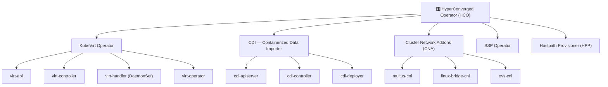
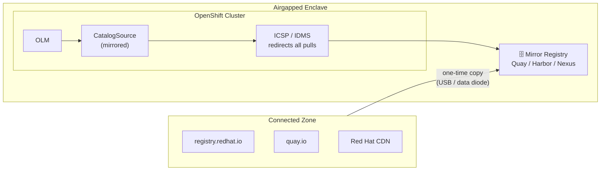
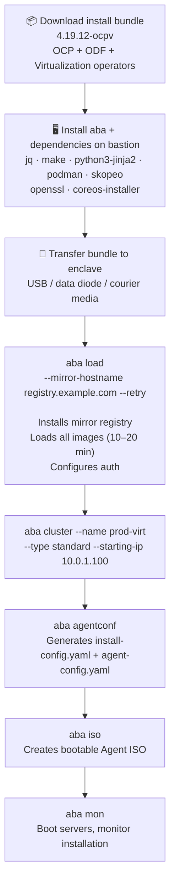
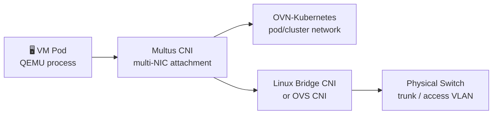

# OpenShift Virtualization (KubeVirt) in Airgapped Environments

If you work in defence, financial services, or any sector where the security team's answer to most questions is "no internet", you'll know that "just install it" is never quite that simple. OpenShift Virtualization is no exception. Every container image, every operator bundle, every VM boot source needs to already be inside the network before you can do anything useful.

This isn't a post that will tell you it's easy — but it's also not as bad as it sounds. Once you understand the moving parts and get the mirroring sorted, the actual cluster experience is pretty much identical to a connected one.

---

## What is OpenShift Virtualization?

Short version: it's Red Hat's productised packaging of [KubeVirt](https://kubevirt.io), a CNCF project that treats VMs as first-class Kubernetes objects. Under the hood it uses KVM, and your VMs appear as `VirtualMachine` custom resources sitting alongside your regular pods. The appeal for most organisations is that you get a single control plane for both containers and VMs, which means you can migrate off your legacy virtualisation platform at whatever pace suits the business rather than doing a big-bang cutover.

IBM ships it as the [Red Hat OpenShift Virtualization Service on IBM Cloud](https://www.ibm.com/products/openshift-virtualization) for customers who want to consolidate VM and container estates — same technology, different delivery model.

> "OpenShift Virtualization uses KubeVirt and KVM to allow teams to migrate and operate VM-based applications directly inside Red Hat OpenShift."  
> — [IBM Cloud](https://www.ibm.com/products/openshift-virtualization)

---

## How It's Actually Structured

One thing that catches people out early: OpenShift Virtualization isn't a single operator you install and walk away from. It's a stack of operators, all coordinated by a meta-operator called the **HyperConverged Operator (HCO)**. The HCO is your single install point — it creates and manages everything else.





Here's what each piece actually does:

| Component | What it does |
|---|---|
| **HCO** | The meta-operator. Creates CRs for everything below it and enforces sane defaults |
| **virt-operator** | Manages the KubeVirt lifecycle — reconciles the `KubeVirt` CR |
| **virt-api** | The API extension that handles all your VM custom resource operations |
| **virt-controller** | Schedules and manages `VirtualMachineInstance` pods |
| **virt-handler** | Runs as a DaemonSet on every worker node, talks directly to QEMU/libvirt |
| **CDI** | Imports VM disk images into PVCs using `DataVolume` — how your VM disks get onto the cluster |
| **CNA** | Gets Multus, Linux Bridge CNI, and OVS CNI onto your nodes for VM networking |
| **SSP** | Handles scheduling, scale, and performance tuning for VMs |
| **HPP** | Provides hostpath-based storage for VM disks when you don't have a fancy CSI |

> Source: [Red Hat OpenShift Virtualization Architecture, OCP 4.12](https://docs.redhat.com/en/documentation/openshift_container_platform/4.12/html/virtualization/virt-architecture)

---

## Why Airgapping Is Actually Hard Here

In a normal connected deployment, OLM just reaches out to `registry.redhat.io` and `quay.io`, grabs the operator catalogue, resolves the bundle, and pulls whatever images it needs. It's all automatic and mostly invisible.

In an airgapped environment, none of that works. The calls silently fail or time out, and you're left with operators stuck in `Pending` with unhelpful error messages. What you need to do instead:

- Mirror every required image to a registry inside the enclave
- Swap out the default `CatalogSource` for one pointing at your mirror
- Apply an `ImageContentSourcePolicy` (or `ImageDigestMirrorSet` on OCP 4.13+) so every image pull gets silently redirected to your mirror

The flow looks like this:





---

## Which Scenario Are You Actually In?

### Partially Connected — Proxy

You've got outbound internet via an HTTP/S proxy. OCP and OLM can be configured with proxy settings and things more or less work without full mirroring. It's simpler to set up but you're still dependent on external availability, and the proxy whitelist will bite you (more on that in the Nice To Knows below).

### Fully Disconnected — Mirror to Registry

This is the classic scenario for government and defence. A bastion host with internet access does a one-time mirror to a tar file on portable media. That media goes through your transfer process into the enclave, gets loaded into the internal registry, and from that point the cluster is completely self-contained. It's more work upfront, but once it's done, it's done.

### Agent ISO — OCP 4.19+ (Developer Preview)

Red Hat shipped something interesting in OCP 4.19: a single ~40 GB Agent ISO that contains the full OCP release payload *and* the virtualization operators baked in. No pre-existing internal registry needed to get started.

> "Seamless deployment in air-gapped networks without a pre-existing image registry."  
> — [Red Hat Developer, August 2025](https://developers.redhat.com/articles/2025/08/15/disconnected-openshift-virtualization-made-easy)

It's still Developer Preview, so weigh that up for production use — but it's a promising direction.

---

## Method 1: Mirror-to-Registry with `oc-mirror`

This is the approach you'd use for most production airgapped deployments running OCP 4.11 through 4.19.

### What you need before you start

- A RHEL 8/9 bastion host with internet access — you only need this for the mirroring step
- A private registry already running inside the enclave (Red Hat Quay, Harbor, Nexus, whatever you've got)
- `oc` CLI and the `oc-mirror` plugin installed on the bastion
- A Red Hat pull secret from [console.redhat.com](https://console.redhat.com)

### Step 1 — Get `oc-mirror` installed

```bash
tar xvzf oc-mirror.tar.gz
chmod +x oc-mirror
sudo mv oc-mirror /usr/local/bin/

oc mirror help
```

### Step 2 — Set up your credentials

```bash
mkdir -p ~/.docker
cat ./pull-secret | jq . > ~/.docker/config.json

podman login registry.redhat.io
```

### Step 3 — Find the right operator package and channel

```bash
oc mirror list operators \
  --catalog=registry.redhat.io/redhat/redhat-operator-index:v4.17 \
  --package=kubevirt-hyperconverged

oc mirror list operators \
  --catalog=registry.redhat.io/redhat/redhat-operator-index:v4.17 \
  --package=kubevirt-hyperconverged \
  --channel=stable
```

### Step 4 — Write your `ImageSetConfiguration`

This is the file that tells `oc-mirror` exactly what to pull. Get this right and the rest is mechanical.

```yaml
# virt-mirror-config.yaml
kind: ImageSetConfiguration
apiVersion: mirror.openshift.io/v1alpha2
storageConfig:
  local:
    path: /mnt/mirror-metadata
mirror:
  platform:
    channels:
    - name: stable-4.17
      type: ocp
  operators:
  - catalog: registry.redhat.io/redhat/redhat-operator-index:v4.17
    targetCatalog: redhat-catalog-v4.17
    packages:
    - name: kubevirt-hyperconverged      # OpenShift Virtualization / HCO
      channels:
      - name: stable
    - name: local-storage-operator
      channels:
      - name: stable
    - name: odf-operator                 # Optional — ODF for VM disk storage
      channels:
      - name: stable-4.17
  additionalImages:
  - name: registry.redhat.io/rhel8/rhel-guest-image:latest
  - name: registry.redhat.io/rhel9/rhel-guest-image:latest
```

### Step 5 — Mirror to disk

Run this on the bastion while you still have internet:

```bash
mkdir /mnt/virt-mirror-disk

oc mirror --verbose 3 \
  --config=virt-mirror-config.yaml \
  file:///mnt/virt-mirror-disk
```

You'll end up with a `mirror_seq1_000000.tar`. Put it on whatever media your transfer process accepts — USB, courier disk, data diode — and move it into the enclave.

### Step 6 — Load images into your internal registry

From inside the enclave:

```bash
oc mirror --verbose 3 \
  --from=./mirror_seq1_000000.tar \
  docker://registry.internal.example.com:5000/openshift4
```

`oc-mirror` drops a set of generated manifests into `oc-mirror-workspace/results-*/` that you'll need for the next step:

```
oc-mirror-workspace/
└── results-1234567890/
    ├── imageContentSourcePolicy.yaml
    ├── catalogSource-redhat-catalog-v4-17.yaml
    └── mapping.txt
```

### Step 7 — Wire up the cluster to use your mirror

```bash
# Kill the default internet-facing catalog sources
oc patch OperatorHub cluster --type json \
  -p '[{"op": "add", "path": "/spec/disableAllDefaultSources", "value": true}]'

# Tell the cluster to redirect image pulls to your mirror
oc apply -f oc-mirror-workspace/results-*/imageContentSourcePolicy.yaml

# Register your mirrored catalog with OLM
oc apply -f oc-mirror-workspace/results-*/catalogSource-redhat-catalog-v4-17.yaml
```

**Heads up:** applying the ICSP triggers a rolling node reboot via `MachineConfigPool`. Build this into your maintenance window — it's not instant.

### Step 8 — Install the HyperConverged Operator

Once nodes are back and the `CatalogSource` shows healthy:

```bash
oc create namespace openshift-cnv

cat <<EOF | oc apply -f -
apiVersion: operators.coreos.com/v1
kind: OperatorGroup
metadata:
  name: kubevirt-hyperconverged-group
  namespace: openshift-cnv
spec:
  targetNamespaces:
  - openshift-cnv
EOF

cat <<EOF | oc apply -f -
apiVersion: operators.coreos.com/v1alpha1
kind: Subscription
metadata:
  name: hco-operatorhub
  namespace: openshift-cnv
spec:
  source: redhat-catalog-v4-17
  sourceNamespace: openshift-marketplace
  name: kubevirt-hyperconverged
  startingCSV: kubevirt-hyperconverged-operator.v4.17.0
  channel: stable
EOF
```

### Step 9 — Create the HyperConverged CR

```bash
cat <<EOF | oc apply -f -
apiVersion: hco.kubevirt.io/v1beta1
kind: HyperConverged
metadata:
  name: kubevirt-hyperconverged
  namespace: openshift-cnv
spec:
  featureGates:
    enableCommonBootImageImport: false   # disable CDN boot source pulls
EOF
```

Check everything came up:

```bash
oc get csv -n openshift-cnv
oc get hyperconverged kubevirt-hyperconverged -n openshift-cnv \
  -o jsonpath='{.status.conditions}' | jq .
```

---

## Method 2: `aba` (OCP 4.19+)

If you're doing this more than once, or you want something repeatable and tested rather than a collection of shell one-liners, take a look at [aba](https://developers.redhat.com/articles/2025/10/14/simplify-openshift-installation-air-gapped-environments). It's an open-source CLI from Red Hat that wraps `oc-mirror` v2, the Agent-Based Installer, and Mirror Registry into one workflow.

> "Aba packages everything you need in one place — install images, CLI tools, registry setup, and automation."  
> — [Red Hat Developer, October 2025](https://developers.redhat.com/articles/2025/10/14/simplify-openshift-installation-air-gapped-environments)

The entire install comes down to three stages:





It supports SNO, compact (3-node), and full standard topologies, VLAN tagging, NIC bonding, oc-mirror v2, all four operator catalogue sources, and has been tested on Arm64. It's upstream/unsupported by Red Hat directly, but Red Hat does support the artefacts it generates — that's an important distinction if you're in a support-conscious environment.

---

## IBM MAS on Disconnected OpenShift

Worth a mention for anyone running IBM Maximo Application Suite in industrial or utilities environments — it's a common pairing. IBM's own [documentation for installing MAS on a disconnected cluster](https://www.ibm.com/docs/en/mas-cd?topic=setup-installing-disconnected-red-hat-openshift-cluster) follows exactly the same mirroring pattern covered above. You're still using `oc-mirror`, still applying ICSP, still swapping out the default OperatorHub sources. The IBM-specific bit is just layering the MAS operator catalogue on top of the base OCP/Virtualization mirror.

If you're going through the [Red Hat Marketplace](https://swc.saas.ibm.com/en-us/redhat-marketplace/documentation/deploy-products-to-a-disconnected-environment) for operator delivery, there's a dedicated disconnected install flow there too.

---

## VM Boot Sources — Don't Forget This

By default, OpenShift Virtualization sets up `DataSource` objects that point at boot images hosted on Red Hat's CDN — RHEL 8, RHEL 9, Fedora, and so on. In a disconnected environment those pulls fail silently and you'll have no templates to work from until you sort it.

You've got two options:

**Option A — Just turn it off (easiest for airgap):**

```yaml
spec:
  featureGates:
    enableCommonBootImageImport: false
```

**Option B — Pre-stage your boot images in the mirror and point CDI at them:**

```yaml
apiVersion: cdi.kubevirt.io/v1beta1
kind: DataVolume
metadata:
  name: rhel9-base
  namespace: openshift-virtualization-os-images
spec:
  source:
    registry:
      url: "docker://registry.internal.example.com:5000/rhel9/rhel-guest-image:latest"
      pullMethod: node
  pvc:
    accessModes:
    - ReadWriteMany
    resources:
      requests:
        storage: 30Gi
```

Option B is more work but gives you a proper template library inside the cluster UI. For most airgapped deployments, Option A to start and Option B when you have time is a reasonable approach.

---

## Networking

VM networking in OpenShift Virtualization is richer than vanilla container networking — VMs often need real layer-2 connectivity to integrate with existing infrastructure. All of the CNI components below are managed by the CNA operator and need to be in your mirror.





One thing worth planning early: live migration. If you want vMotion-equivalent behaviour (and you almost certainly do), you need a dedicated migration network with enough bandwidth — Red Hat recommends ≥10 GbE. Sort the network topology before you start, not after.

---

## Upgrades in Airgapped Environments

Upgrades follow the same pattern as the initial install, which is good news — there's no separate upgrade procedure to learn.

1. Re-run `oc-mirror` (or `aba load`) with updated version ranges in your `ImageSetConfiguration`
2. Apply the fresh `ImageContentSourcePolicy` — oc-mirror v2 supports incremental diffs so you're not re-shipping everything
3. Let OLM auto-update within the approved channel, or pin the `startingCSV` manually
4. HCO coordinates the sub-operator upgrades sequentially to keep disruption minimal

If you're using `aba`, it can also stand up a local **OpenShift Update Service (OSUS)** instance inside the enclave — an internal copy of the `api.openshift.com` update graph server, so your cluster thinks it's talking to Red Hat when it's actually talking to something in your own network.

---

## When Things Go Wrong

| What you're seeing | What's probably happening | What to do |
|---|---|---|
| `ImagePullBackOff` on virt-operator pods | ICSP applied but node reboot hasn't finished | `oc get mcp` — wait for the roll-out |
| `CatalogSource` stuck in `CONNECTING` | Mirror registry TLS cert isn't trusted by the cluster | Add CA cert via `oc create configmap` in `openshift-config`, patch `image.config.openshift.io` |
| CDI importer `401 Unauthorized` | Pull secret not present for the internal registry | Create a `dockerconfigjson` secret in `openshift-virtualization-os-images` |
| Boot source PVC stuck in `Pending` | No default StorageClass set | `oc patch storageclass <name> -p '{"metadata":{"annotations":{"storageclass.kubernetes.io/is-default-class":"true"}}}'` |
| HCO `ReconcileError` | A sub-operator image tag wasn't included in the mirror | Re-run oc-mirror with a broader `minVersion`/`maxVersion` range |

---

## Nice To Knows

These are the things that don't really make it into the official docs but will save you real time on a project.

### 1. The Proxy Whitelist Keeps Changing — and It's Not Just Red Hat Domains

If you're going the proxy route rather than full mirroring, you'll quickly find that the hostname list is longer than you'd expect and shifts between OCP releases. Red Hat publishes an [official endpoint list](https://docs.openshift.com/container-platform/4.17/installing/install_config/configuring-firewall.html), but these are the entries that most commonly catch people out:

| Hostname | Why it's needed |
|---|---|
| `registry.redhat.io` | Operator and component images |
| `quay.io` | Some operator images live here, not on registry.redhat.io |
| `cdn.quay.io` | Blob/layer storage backing quay.io |
| `cdn01.quay.io`, `cdn02.quay.io`, `cdn03.quay.io` | CDN shards — the apex domain alone isn't enough |
| `sso.redhat.io` | Auth for registry.redhat.io |
| `api.openshift.com` | Cluster telemetry, update graph |
| `cert-api.access.redhat.com` | Entitlement checks |
| `access.redhat.com` | Subscription Manager |
| `infogw.api.openshift.com` | Insights operator |
| `console.redhat.com` | Pull secret validation, Assisted Installer |
| `rhcos.mirror.openshift.com` | RHCOS images during install |
| `mirror.openshift.com` | OCP release artefacts |
| `storage.googleapis.com` | Some RHCOS artefacts are served from Google Cloud Storage |

The `storage.googleapis.com` entry is the one that consistently surprises people — it's a Google domain, so it gets blocked by default in most corporate proxy policies. Raise it with your network/security team early. The `cdn01–03.quay.io` shards are another one that bites you because engineers test against `quay.io` directly, see it work, and assume that's sufficient.

**Practical tip:** after your first install attempt, run `oc adm must-gather` and grep the collected logs for `connection refused` or `dial tcp`. That'll surface missing proxy entries much faster than trying to audit the docs.

---

### 2. Coming from VMware? Tell Your AI Assistant That Up Front

The conceptual model in OpenShift Virtualization is genuinely different from vSphere — but it's not alien once you have the right mental map. If you're using an AI assistant to help with config problems, start your session with something like:

> "I have 10 years of VMware vSphere and NSX-T experience. I'm learning OpenShift Virtualization / KubeVirt. Please compare concepts to VMware equivalents where it's helpful."

That one sentence changes the quality of answers significantly. An AI that knows your context will translate naturally rather than explaining concepts from scratch. Here's the cheat sheet:

| VMware | OpenShift Virtualization |
|---|---|
| vCenter | OCP Console + `virtctl` CLI |
| ESXi host | Worker node running `virt-handler` (DaemonSet) |
| VM snapshot | `VirtualMachineSnapshot` CR |
| vMotion (live migration) | `VirtualMachineInstanceMigration` CR |
| OVA / OVF import | CDI `DataVolume` with HTTP or registry source |
| Distributed vSwitch (VDS) | OVN-Kubernetes + Multus + Linux Bridge CNI |
| NSX-T micro-segmentation | OCP NetworkPolicy + NMState |
| VMFS / vSAN datastore | OpenShift Data Foundation (ODF) / StorageClass |
| Content Library | `DataSource` + `DataImportCron` in openshift-virtualization-os-images |
| HA / DRS | Kubernetes scheduler + pod disruption budgets |

It's not 1:1 in every case — the Kubernetes abstraction model means some things work differently at a fundamental level — but having this vocabulary bridge makes you productive much faster.

---

### 3. Third-Party CNI / CSI Registries — Get the URLs Before You Start

This one is responsible for a genuinely painful number of project delays. If your design includes a third-party CNI (Calico, Cilium, SR-IOV Network Operator) or a CSI driver (NetApp Trident, Pure Storage PSO, Dell CSI), you need every image registry and endpoint for those components **before you raise your first firewall change request**.

Here's how it plays out when you don't:

```
Week 1  → OCP base cluster installs fine
Week 3  → OpenShift Virtualization installs fine
Week 5  → Calico fails — pulls from quay.io/tigera
          Firewall change request raised. 2-week change window.
Week 7  → Calico up. Trident fails — pulls from docker.io/netapp
          Another change request. Another 2 weeks.
Week 9  → 4 weeks behind. Nobody is happy.
```

Do a single comprehensive image audit at the start of the project. For each third-party component:

1. **Operator bundle images** — what registry does OLM pull the operator from?
2. **Operand images** — what do the pods the operator deploys pull from?
3. **Init/sidecar images** — easy to miss; grep the operator CSV for every `image:` field
4. **Helm chart images** — if it ships via Helm, check `values.yaml` for every `repository:` key

Quick ways to check before you install:

```bash
# Check what's in an operator bundle
oc mirror list operators \
  --catalog=registry.redhat.io/redhat/redhat-operator-index:v4.17 \
  --package=sriov-network-operator \
  --channel=stable

# Extract all image refs from a Helm chart
helm template <release> <chart> | grep 'image:' | sort -u
```

Common third-party registries that show up in OpenShift Virtualization-adjacent deployments:

| Component | Registry |
|---|---|
| Calico / Tigera | `quay.io/tigera`, `docker.io/calico` |
| Cilium | `quay.io/cilium` |
| SR-IOV (upstream) | `ghcr.io/k8snetworkplumbingwg` |
| NetApp Trident | `docker.io/netapp` |
| Rook / Ceph | `quay.io/ceph`, `quay.io/cephcsi` |
| Longhorn | `docker.io/longhornio` |
| Cert-manager | `quay.io/jetstack` |
| MetalLB | `quay.io/metallb` |

Also worth noting: `docker.io` (Docker Hub) has rate limiting on unauthenticated pulls, independent of any firewall questions. If anything in your stack pulls from there, factor in either a paid Docker account, a pull-through cache, or mirroring those images to your internal registry. And yes — that needs to be in the firewall request too.

Treat the registry/URL audit as a project deliverable on day one, not something you get to when things start failing.

---

## References

- [Disconnected OpenShift Virtualization Made Easy — Red Hat Developer (August 2025)](https://developers.redhat.com/articles/2025/08/15/disconnected-openshift-virtualization-made-easy)
- [Simplify OpenShift Installation in Air-Gapped Environments — Red Hat Developer (October 2025)](https://developers.redhat.com/articles/2025/10/14/simplify-openshift-installation-air-gapped-environments)
- [Deploying Red Hat OpenShift Operators in a Disconnected Environment — Red Hat Blog](https://www.redhat.com/en/blog/deploying-red-hat-openshift-operators-disconnected-environment)
- [Red Hat OpenShift Disconnected Installations — Red Hat Blog](https://www.redhat.com/en/blog/red-hat-openshift-disconnected-installations)
- [Mirroring Images Using oc-mirror Plugin (OCP 4.16) — Red Hat Docs](https://docs.openshift.com/container-platform/4.16/installing/disconnected_install/installing-mirroring-disconnected.html)
- [OpenShift Virtualization Architecture (OCP 4.12) — Red Hat Docs](https://docs.redhat.com/en/documentation/openshift_container_platform/4.12/html/virtualization/virt-architecture)
- [HyperConverged Operator — KubeVirt.io](https://kubevirt.io/2019/Hyper-Converged-Operator.html)
- [Red Hat OpenShift Virtualization Service — IBM Cloud](https://www.ibm.com/products/openshift-virtualization)
- [Installing MAS on a Disconnected OpenShift Cluster — IBM Docs](https://www.ibm.com/docs/en/mas-cd?topic=setup-installing-disconnected-red-hat-openshift-cluster)
- [Using oc-mirror on IBM Z and LinuxONE — IBM Community](https://community.ibm.com/community/user/ibmz-and-linuxone/viewdocument/using-the-oc-mirror-plugin-for-disc)
- [Install Operators on Disconnected Clusters — Red Hat Marketplace / IBM](https://swc.saas.ibm.com/en-us/redhat-marketplace/documentation/deploy-products-to-a-disconnected-environment)
- [Hosted Control Planes on OpenShift Virtualization in Disconnected Environments — OKD 4.18 Docs](https://docs.okd.io/4.18/hosted_control_planes/hcp-disconnected/hcp-deploy-dc-virt.html)
